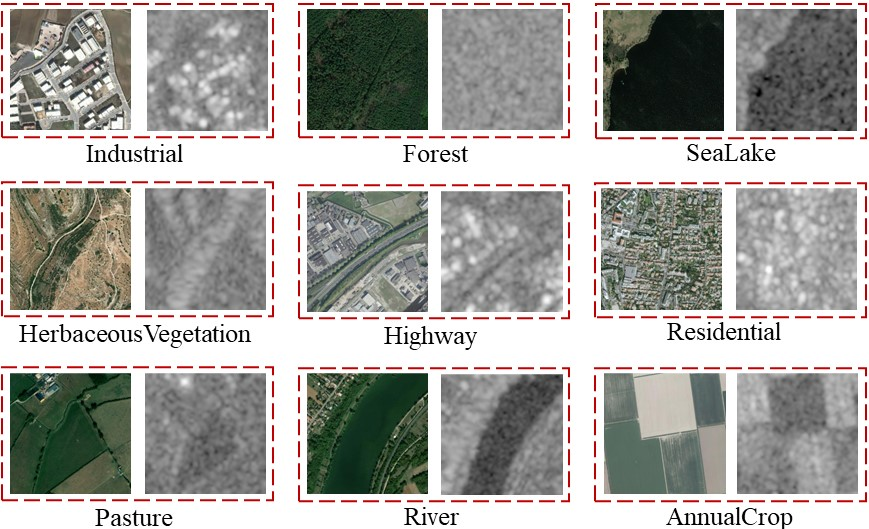

# CBRSIR_VS



CBRSIR_VS is a cross-modal dataset for very high-resolution (VHR) optical and synthetic-aperture radar (SAR) image retrieval. CBRSIR_VS contains 10 class labels and 26,901 pairs of VHR and SAR images. VHR images are collected from Google Earth Imagery and ArcGIS map, and SAR images are collected from Sentinel-1 imagery via Google Earth Engine.

The download link is [CBRSIR_VS](https://drive.google.com/file/d/1dSzh3HjBT9dmsQaZdsTOpvxPQfXaKgs-/view?usp=sharing) 

----------------------------------------------------------------
### Citation
CBRSIR_VS is first released in this paper, if you find it helpful in your research, please cite our paper.

```
@ARTICLE{sun9656147,
  title={Multi-sensor Fusion and Explicit Semantic Preserving-based Deep Hashing for Cross-Modal Remote Sensing Image Retrieval}, 
  author={Sun, Yuxi and Feng, Shanshan and Ye, Yunming and Li, Xutao and Kang, Jian and Huang, Zhichao and Luo, Chuyao},
  journal={IEEE Transactions on Geoscience and Remote Sensing}, 
  year={2021}
}
```
